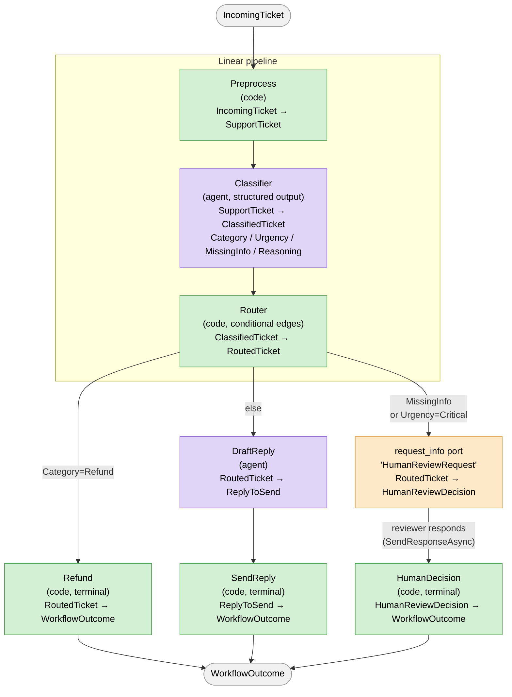

# MAF Workflow — Support Ticket Triage

A small Microsoft Agent Framework (MAF) workflow that triages incoming support
tickets: a code executor normalizes the ticket, an LLM agent classifies it
(category / urgency / missing info), a code router applies business rules to
pick a route, and the ticket is then either auto-replied (LLM-drafted),
processed as a refund, or escalated to a human reviewer via a
`request_info` human-in-the-loop port.

## Why Does This Project Exist
 
Support teams waste time manually reading and routing tickets to the right
handler. This project demonstrates how an LLM-powered workflow can automate
that triage — classifying tickets by category and urgency, applying
deterministic business rules, and escalating edge cases to a human reviewer —
while keeping the LLM out of routing decisions entirely.

## Architecture

```
src/TicketTriage.Workflow/
├── Domain/
│   ├── Models/        # Plain records/enums — no agent or MAF dependencies
│   └── Validation/     # TicketClassificationValidator (pure business logic)
├── Agents/             # AIAgent factories (Classifier, DraftReply)
├── Infrastructure/      # ChatClientFactory, ChatModelOptions (model config)
├── Workflow/
│   ├── Executors/      # The 7 graph nodes (ReflectingExecutor)
│   └── SupportTriageWorkflowFactory.cs  # WorkflowBuilder graph definition
└── Program.cs          # DI wiring, sample run, event streaming

tests/TicketTriage.Workflow.Tests/
├── RouterExecutorTests.cs              # routing rule unit tests
└── TicketClassificationValidatorTests.cs
```

- **Domain** has zero dependencies on agents/LLMs/MAF — it's plain C#.
- **Agents** are single-purpose, structured-output (`ChatResponseFormat.ForJsonSchema`) `ChatClientAgent`s.
- **Workflow/Executors** wrap agents or plain code as `ReflectingExecutor<TSelf>` + `IMessageHandler<TIn, TOut>` nodes.
- **Infrastructure** centralizes the `IChatClient` configuration (provider-agnostic OpenAI-compatible endpoint — works with Groq, Azure OpenAI, GitHub Models, etc.).

## Tech Stack
 
| Layer | Technology |
|-------|-----------|
| Language | C# / .NET 8 |
| Agent Framework | Microsoft Agent Framework (MAF) 1.10.0 |
| LLM Integration | Microsoft.Extensions.AI + OpenAI SDK |
| LLM Provider | Any OpenAI-compatible endpoint (Groq, Azure OpenAI, GitHub Models) |
| Structured Output | `ChatResponseFormat.ForJsonSchema` |
| Testing | xUnit |
| CI | GitHub Actions |
| Containerization | Docker + docker-compose |

## Workflow diagram



## Executors

| # | Executor | Type | In → Out | Responsibility |
|---|---|---|---|---|
| 1 | `PreprocessExecutor` | code | `IncomingTicket` → `SupportTicket` | Assign ticket ID, timestamp, trim input |
| 2 | `ClassifierExecutor` | agent | `SupportTicket` → `ClassifiedTicket` | LLM classification (Category/Urgency/MissingInfo/Reasoning), validated |
| 3 | `RouterExecutor` | code | `ClassifiedTicket` → `RoutedTicket` | Apply routing business rules (3 routes) |
| 4 | `RefundExecutor` | code, terminal | `RoutedTicket` → `WorkflowOutcome` | Initiate refund (deterministic) |
| 5 | `DraftReplyExecutor` | agent | `RoutedTicket` → `ReplyToSend` | LLM drafts an email reply |
| 6 | `SendReplyExecutor` | code, terminal | `ReplyToSend` → `WorkflowOutcome` | "Send" the drafted reply |
| 7 | `HumanDecisionExecutor` | code, terminal | `HumanReviewDecision` → `WorkflowOutcome` | Resolve outcome after human review |

### Routing rules (`RouterExecutor.DetermineRoute`)
 
1. `IsRedFlag == true` → **HumanReview** (deterministic, before LLM)
2. `MissingInfo == true` **or** `Urgency == Critical` → **HumanReview**
3. `Confidence == Low` → **HumanReview**
4. else `Category == Refund` → **Refund**
5. else → **AutoReply** (draft + send)

## Engineering Decisions
 
- **Classifier proposes, router decides** — the LLM only classifies (category, urgency, confidence). All routing logic lives in plain C# (`RouterExecutor.DetermineRoute`), making it testable and auditable without touching the LLM.
- **Structured output over free text** — the classifier returns a typed JSON schema, eliminating fragile string parsing.
- **Red-flag detection before the LLM** — obvious critical keywords (e.g. "hacked", "urgent") are caught deterministically in `PreprocessExecutor` before any LLM call, for speed and safety.
- **Domain has zero LLM dependencies** — all models and enums in `Domain/` are plain C# records, so they can be unit tested without mocking agents or running the workflow.
- **Audit log on every run** — every ticket's classification and route is written to `audit.jsonl` for traceability.

## Configuration

The chat model is configured under the `"ChatModel"` section
(`Endpoint`, `ApiKey`, `ModelId`) in
[appsettings.json](src/TicketTriage.Workflow/appsettings.json), environment
variables, or user secrets — **never commit a real API key**.
`appsettings.json` ships with `ApiKey: ""`.

Set your key via user secrets (run from `src/TicketTriage.Workflow/`):

```bash
dotnet user-secrets set "ChatModel:Endpoint" "https://api.groq.com/openai/v1"
dotnet user-secrets set "ChatModel:ApiKey" "<your-groq-api-key>"
dotnet user-secrets set "ChatModel:ModelId" "openai/gpt-oss-120b"
```

Any OpenAI Chat Completions–compatible endpoint works (Groq, Azure OpenAI's
`/openai/v1` surface, GitHub Models, etc.) — `ChatClientFactory` just needs
Endpoint + ApiKey + ModelId.

## Running

Run with the built-in sample tickets:
 
```bash
dotnet run --project src/TicketTriage.Workflow
```
 
Run with your own CSV file:
 
```bash
dotnet run --project src/TicketTriage.Workflow -- samples/tickets.csv
```
 
CSV format (see `samples/tickets.csv` for an example):
```
CustomerName,Subject,Body
Alice Nguyen,Can't log into my account,"I've been trying to log in..."
```
 
This streams `executor_invoked` / `executor_completed` / `request_info` / `output`
events to the console, and writes an audit log to `audit.jsonl`.

## Running with Docker
 
Copy the example env file and fill in your API key:
 
```bash
cp .env.example .env
# Edit .env with your real API key
```
 
Then run with one command:
 
```bash
docker-compose up
```

## Testing
 
```bash
dotnet test --filter "Category!=Integration"
```
 
Covers `RouterExecutor.DetermineRoute` routing rules and
`TicketClassificationValidator` (including malformed/incomplete classifier output).
 
To run the full eval suite (requires a live API key):
 
```bash
dotnet test --filter "Category=Integration"
```
 
## Example Output
 
Input ticket:
```
Customer: David Kim
Subject: Can't log into my account
Body: I've tried resetting my password three times today and the reset
email never arrives. I need access today to finish payroll for my team.
```
 
Output:
```
[executor_invoked] PreprocessExecutor
[executor_completed] PreprocessExecutor
[executor_invoked] ClassifierExecutor
[executor_completed] ClassifierExecutor → Category=AccountAccess, Urgency=High
[executor_invoked] RouterExecutor → Route=AutoReply
[executor_invoked] DraftReplyExecutor
[executor_completed] DraftReplyExecutor
[output] WorkflowOutcome: AutoReply sent
```
 
## Quality Gates
 
| Gate | Tool | Command | Status |
|------|------|---------|--------|
| Build | dotnet build | `dotnet build` | ✅ |
| Unit tests | xUnit | `dotnet test --filter "Category!=Integration"` | ✅ 18 passing |
| Eval tests (LLM) | xUnit | `dotnet test --filter "Category=Integration"` | ✅ 5 scenarios |
| CI | GitHub Actions | on every push to main | ✅ |
 
## Known Limitations
 
- **No persistence** — tickets and outcomes are in-memory only, nothing is saved to a database.
- **Eval tests are non-deterministic** — LLM responses vary, so eval tests may occasionally fail on edge cases.
- **Simulated side effects** — refund processing and email sending are logged to console, not connected to real systems.
- **CSV parser is basic** — does not handle all edge cases (e.g. commas inside quoted fields).

## What I Would Improve Next
 
- Persist audit log to a file or database for production use.
- Connect to a real email sender and refund API.
- Add a web API endpoint so tickets can be submitted via HTTP.
- Improve CSV parsing to handle all RFC 4180 edge cases.
 
